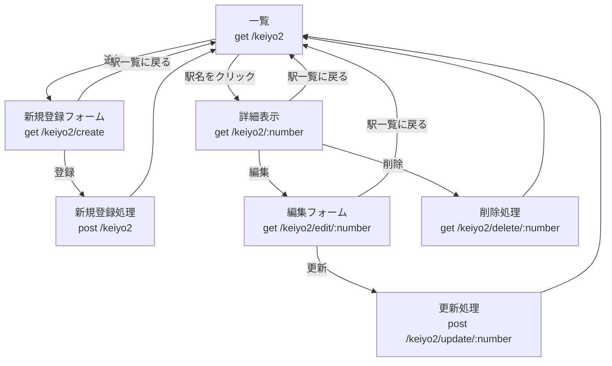

# keiyo2 のページ遷移図

削除は詳細ページから行う．

```mermaid
flowchart TD
    list["一覧<br>get /keiyo2"]
    new["新規登録フォーム<br>get /keiyo2/create"]
    create["新規登録処理<br>post /keiyo2"]
    detail["詳細表示<br>get /keiyo2/:number"]
    edit["編集フォーム<br>get /keiyo2/edit/:number"]
    update["更新処理<br>post /keiyo2/update/:number"]
    del["削除処理<br>get /keiyo2/delete/:number"]

    list -->|追加| new
    new -->|登録| create
    create --> list
    new -->|駅一覧に戻る| list
    list -->|駅名をクリック| detail
    detail -->|編集| edit
    edit -->|更新| update
    update --> list
    edit -->|駅一覧に戻る| list
    detail -->|削除| del
    del --> list
    detail -->|駅一覧に戻る| list
```